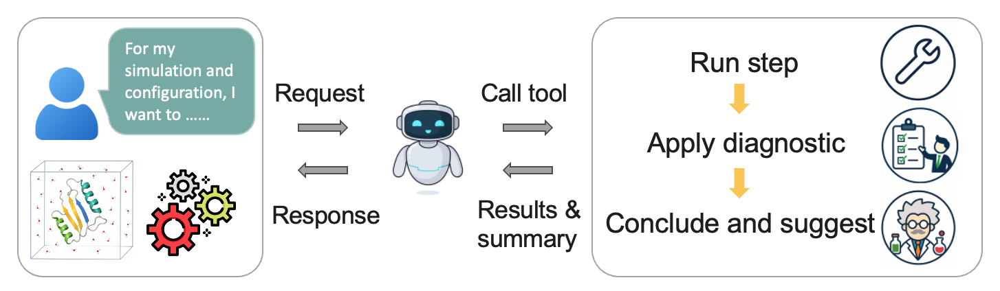
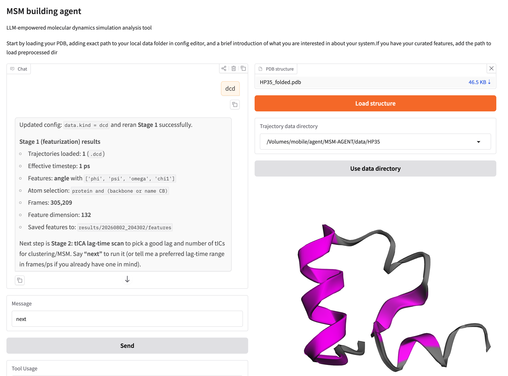
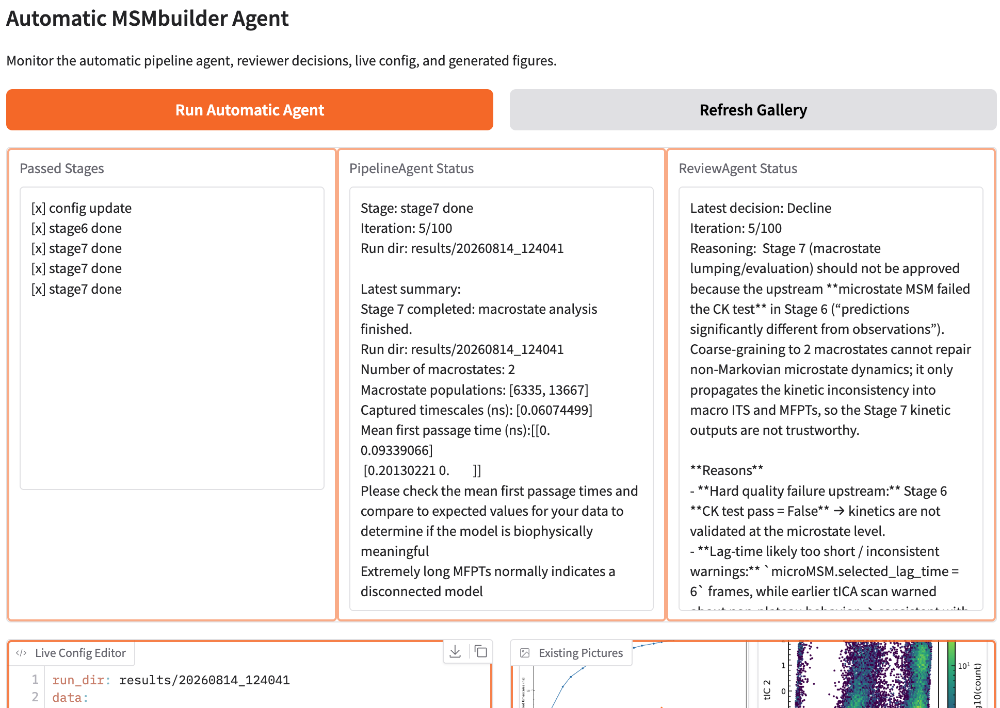

# MSM Agent Pipeline



MSM Agent is an interactive, human-in-the-loop system for constructing Markov state models (MSMs) from molecular dynamics simulations. It combines a fixed, reproducible MSMBuilder workflow with an LLM that can:

- inspect molecular topology and suggest suitable features;
- interpret model-quality diagnostics and warnings;
- recommend parameter adjustments based on expert knowledge; and
- guide the pipeline from featurization through macrostate construction.

The numerical work remains organized as a seven-stage pipeline:

```text
Stage 1: MD trajectories -> molecular features
    |
Stage 2: Scan tICA parameters, including lag time and component count
    |
Stage 3: Select parameters and fit tICA (features -> tICs)
    |
Stage 4: Cluster the projected data (tICs -> cluster assignments)
    |
Stage 5: Scan MSM parameters, including lag time and timescale count
    |
Stage 6: Fit the microstate MSM (cluster assignments -> microstate model)
    |
Stage 7: Lump microstates and evaluate the model (microstates -> macrostates)
```

## Requirements

- Python 3.10 or later
- [MSMBuilder 2022](https://github.com/msmbuilder/msmbuilder2022)
- An OpenAI API key when using the OpenAI-backed agents
- Conda (recommended) or another Python environment manager 

## Installation

### Conda setup

Review `setup.sh` and replace the API-key placeholder before running it. The script creates a Python 3.11 Conda environment, installs this project and MSMBuilder 2022, and configures the OpenAI API key.

```bash
bash setup.sh
```

After installation, reactivate the environment so the configured environment variables are available:

```bash
conda activate agent
```

### Manual setup

Create and activate a virtual environment, then run the following commands from the repository root:

```bash
python -m pip install .
git clone https://github.com/msmbuilder/msmbuilder2022.git
python -m pip install ./msmbuilder2022
export OPENAI_API_KEY="your_api_key_here"
```

For persistent credentials, configure `OPENAI_API_KEY` through your shell or environment manager instead of committing it to the repository.

## Run the human-in-the-loop agent

Start the interactive OpenAI agent with:

```bash
python agent_openai.py
```

Open the Gradio URL printed in the terminal. In the interface, you can edit the YAML configuration directly or ask the agent to update supported parameters for you.



## Run the automatic search agent

Start the automatic pipeline and reviewer agents with:

```bash
python agent_auto.py
```

The pipeline agent executes and adjusts stages, while the reviewer agent inspects each result before the workflow proceeds.



## Results

Each run receives its own directory under `results/` by default. Depending on the completed stages, this directory contains the resolved configuration, intermediate artifacs, manifests, saved model, and generated figures.

The Gradio interfaces display the active configuration, current stage, latest summary, and available plots while the pipeline is running.

## Local-model support

Experimental Ollama-related implementations are included in the repository (but are currently removed in this version). Ensure the Ollama server is running and review the relevant backend configuration before using those implementations.
